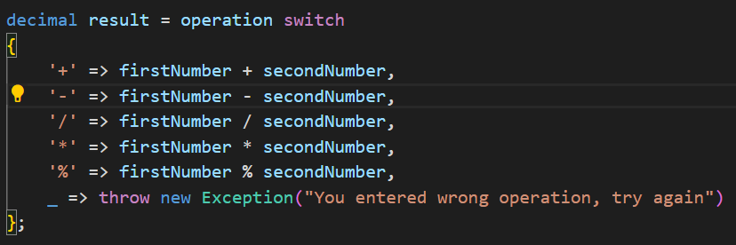

# Calculator

This project shows how I can successfully use data types & arithmetic operations.

Have a look at `Program.cs` file and you can see how I have used:

1. Console input/output =>

    

2. Arithmetic operation with `switch` expression =>

    

## How can you run this code in your laptop?

1. You should go my *Github* profile and repository which is named **[Calculator](https://github.com/JohnnySenior/Calculator)**.

2. Copy the code and clone your laptop.

    <video src="JohnnySenior_Calculator_%20This%20is%20console%20app%20that%20can%20do%20basic%20operations%20like%20add,%20multiply%20etc%20-%20Google%20Chrome%20-%2018%20July%202023%20(1).mp4" controls title="Title"></video>