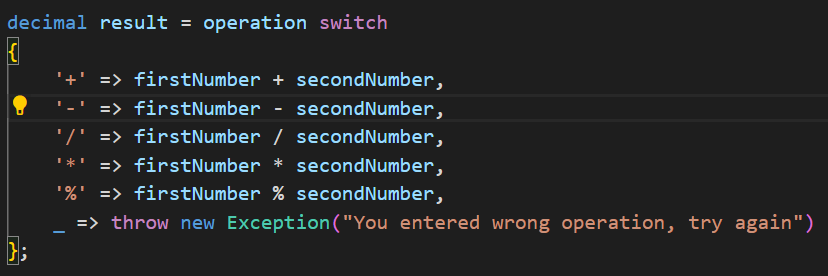

# Calculator

This project shows how I can successfully use data types & arithmetic operations.

Have a look at `Program.cs` file and you can see how I have used:

1. Console input/output =>

    

2. Arithmetic operation with `switch` expression =>

    

## How can you run this code in your laptop?

1. You should go my *Github* profile and repository which is named **[Calculator](https://github.com/JohnnySenior/Calculator)**.

2. Copy the code and **[clone](https://www.loom.com/share/9cebefe04b8b40f0bb6c48f87f58ad59?sid=fdb619c9-6bf3-4cf8-bb5b-a907855b4625)** your laptop.

   