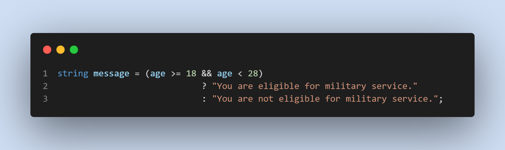

# Calculator

We are thrilled to announce the highly anticipated release of Console App version 3.0, the final and most feature-rich version of our application. This release brings a plethora of improvements, new functionalities, and enhanced user experience.

Have a look at `Program.cs` file and you can see how I have used:

1. Console input/output =>

    

2. Arithmetic operation with switch expression =>

    

3. Ternery operator =>

    

4. Foor Loop =>

    

5. `try`, `catch` =>
    

6. `Methods` => I create several **_methods_** and refactored with these methods.

    * Creating method:

        

    * Calling method:

        

7. Result =>

    

    

## How can you run this code in your laptop?

1. You should go my *Github* profile and repository which is named **[Calculator](https://github.com/JohnnySenior/Calculator)**.

2. Click green butten and you can watch my instruction **[video](https://www.loom.com/share/9cebefe04b8b40f0bb6c48f87f58ad59?sid=fdb619c9-6bf3-4cf8-bb5b-a907855b4625)**.

## Release Note

### V1.0

We are excited to announce the release of version 1.0 of our Calculator App! This release introduces basic arithmetic calculations.

Features Added:

* Addition: You can now add two or more numbers using the + operator.
* Subtraction: Perform subtraction of one number from another using the - operator.
* Multiplication: Multiply numbers together using the * operator.
* Division: Divide one number by another using the / operator.
* Modulo: Divide one number by another using % operation and take the reminder.

### Path to Version 1.0

Click green word if you want to go **[Version 1.0](https://github.com/JohnnySenior/Calculator/tree/releases/v1.0)**

### V2.0

We are excited to announce the release of version 2.0 of our Calculator App! This release introduces basic arithmetic calculations.

Features Added:

* Bug fixes and other minor improvements.
* Add `switch` expression.

### Path to Version 2.0

Click green word if you want to go **[Version 2.0](https://github.com/JohnnySenior/Calculator/tree/releases/v2.0)**

### v3.0

We are excited to announce the release of Calculator App version 3.0, the final version of our application. This version brings significant improvements and new features to enhance your user experience. Below are the key highlights of this release:

Features Added:

* Age Calculator
    * If you input your age app shows you which is you are eligible or not for army.
* Multiplication Table
    * You input numbers app shows you perfect table.

### Path to Version 3.0

Click green word if you want to go **[Version 3.0](https://github.com/JohnnySenior/Calculator/tree/releases/v3.0)**

### V3.1

We are excited to announce the release of version 3.1 of our Calculator App! This release introduces `try catch` operation.

Features Added:

* Add `try catch` operation.

Note: You are in **_Version 3.1_** now.
